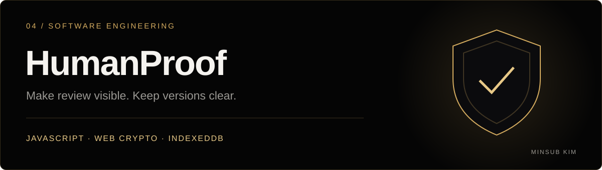
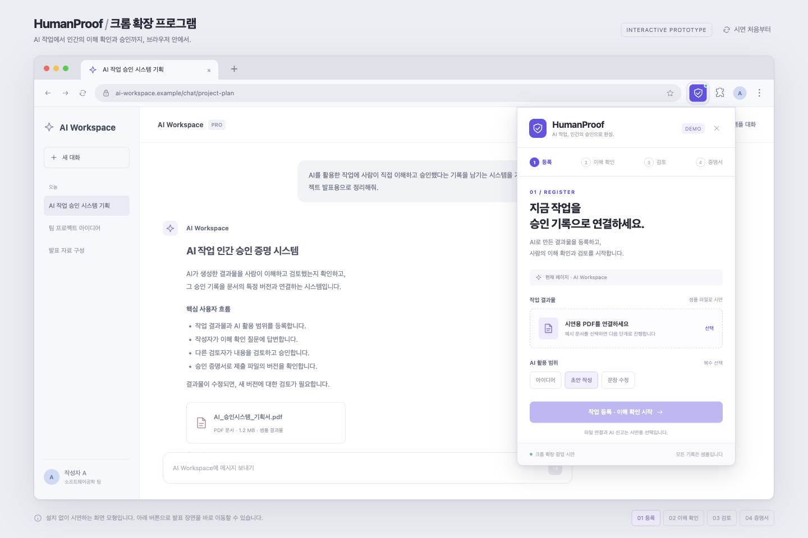
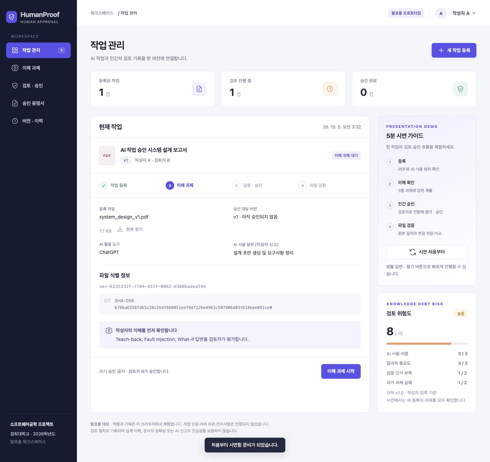

<!-- MINSUB-BRAND:START -->
<p align="center">
  <a href="https://minsub-kim-portfolio.vercel.app/projects/humanproof/"></a>
</p>
<p align="center">
  <a href="https://minsub-kim-portfolio.vercel.app/"></a>
</p>
<p align="center">
  <a href="https://minsub-kim-portfolio.vercel.app/projects/humanproof/">프로젝트 스토리</a> · <a href="https://github.com/minsub1489">개발자 프로필</a> · <a href="https://minsub-kim-portfolio.vercel.app/">포트폴리오</a>
</p>
<!-- MINSUB-BRAND:END -->

---

# Software Engineering · HumanProof

AI 작업의 인간 검토·승인 기록을 특정 PDF 버전에 연결하는 소프트웨어공학 팀 프로젝트의 발표용 프로토타입입니다.

## 크롬 확장 프로그램 형태의 프로토타입

발표용 클릭 프로토타입입니다. 크롬 브라우저 모형에서 보라색 방패 아이콘을 누르면 HumanProof 팝업이 열립니다. HTML 한 개로 동작하며 확장 프로그램 설치가 필요하지 않습니다.



1. 저장소를 내려받고 `prototype/HumanProof_크롬확장_프로토타입.html`을 브라우저로 엽니다.
2. 팝업에서 샘플 PDF 연결 → 작업 등록 → 세 질문에 샘플 답변 제출을 진행합니다.
3. 검토자 B로 전환하고 체크리스트를 확인한 뒤 승인합니다.
4. 증명서에서 원본과 수정 파일의 비교 예시를 보여줍니다.

화면 아래 `01 등록`~`04 증명서`로 발표 장면을 바로 이동할 수 있습니다. 짧은 화면에서는 팝업 안을 스크롤합니다. 파일, 승인 기록과 검증 결과는 샘플이며 실제 파일 처리나 서버 연동은 하지 않습니다.

자세한 순서는 [크롬 확장 프로토타입 시연 가이드](prototype/크롬확장_시연가이드.md)를 참고하세요.

## 기존 웹 프로토타입 실행하기



### 설치 없이 실행

1. 이 저장소를 ZIP으로 내려받거나 복제합니다.
2. `prototype/HumanProof_프로토타입.html`을 Chrome 또는 Edge로 엽니다.
3. 기본 샘플 작업으로 시연을 시작합니다.

샘플 자료, 스타일과 스크립트를 HTML에 포함했으므로 패키지 설치가 필요하지 않습니다.

### 로컬 서버로 실행

Python 3가 설치된 환경에서 저장소의 최상위 폴더에서 실행합니다.

```sh
python3 -m http.server 4173 --bind 127.0.0.1 --directory prototype/dist
```

브라우저에서 **http://127.0.0.1:4173/** 을 엽니다. 종료는 터미널에서 `Ctrl+C`입니다.

## 기존 웹 프로토타입 시연 흐름

1. **PDF 등록과 AI 사용 신고**: 파일 버전 ID와 실제 SHA-256 해시를 확인합니다.
2. **이해 과제**: Teach-back, Fault Injection, What-if 답변과 자기 확신도를 제출합니다.
3. **인간 검토·승인**: 검토자 B로 전환해 답변을 평가하고 체크리스트와 검토 근거를 확인합니다.
4. **증명서와 파일 검증**: 승인된 버전과 원본·변경 파일의 일치 여부를 각각 확인합니다.
5. **변경·철회**: 새 버전은 재승인을 요구하며, 승인 철회는 별도 상태로 표시합니다.

빠른 시연은 `3개 샘플 답변 채우기`, `샘플 평가 채우기` 버튼을 사용합니다. 각 과제의 답변은 직접 제출하고, 필수 체크리스트도 직접 확인합니다. 반복 시연은 `시연 처음부터` 버튼으로 시작합니다.

자세한 순서와 발표 멘트는 [5분 시연 가이드](prototype/시연가이드.md)를 참고하세요.

## 기존 웹 프로토타입 범위

- PDF 파일 형식·20 MB 크기 검사와 SHA-256 비교는 실제로 동작합니다.
- 자기 승인, 과제 미통과, 치명 오류, 미완료 체크리스트는 승인을 차단합니다.
- 역할은 시연을 위한 전환 기능입니다. 실제 계정 인증·서버 권한 검사·DB·전자서명은 연결하지 않았습니다.
- 시연 기록은 현재 브라우저에 저장됩니다. 다른 기기의 QR 화면에는 발급 당시 요약만 표시하며 현재 효력을 확인했다고 표시하지 않습니다.
- PDF·작업·승인·감사 기록은 IndexedDB에 저장됩니다. 저장 실패는 롤백하며, 여러 탭의 변경 충돌은 revision 검사로 차단합니다.
- 수정 요청은 이전 검토 회차를 보존하고 현재 평가·체크리스트를 초기화합니다. 승인된 답변과 기여 근거는 영수증의 검토 범위 해시에 고정됩니다.
- 승인 기록은 검토 절차의 근거입니다. 실제 이해, 문서의 사실 정확성, AI 사용 신고의 진실성을 보증하지 않습니다.

## 파일 구성

```text
prototype/
├── HumanProof_크롬확장_프로토타입.html  # 크롬 모형과 확장 팝업을 시연하는 단독 HTML
├── 크롬확장_시연가이드.md             # 확장 팝업 시연 안내
├── chrome-preview.jpg               # 크롬 확장 팝업 미리보기
├── HumanProof_프로토타입.html  # 설치 없이 실행하는 단독 HTML
├── 시연가이드.md             # 발표 순서와 시연 안내
├── preview.jpg               # 화면 미리보기
└── dist/
    ├── index.html            # 페이지 문서
    ├── styles.css            # 반응형 레이아웃
    ├── app.js                # 화면과 시연 상태 처리
    ├── domain.js             # 승인 규칙·불변식·입력·해시 검증
    ├── repository.js         # IndexedDB 원자적 저장·동시 변경 검사
    ├── qrcode.min.js         # QR 생성 라이브러리
    └── QRCODE-LICENSE.txt     # 라이브러리 라이선스
```

문항, 샘플 답변과 화면 동작은 `prototype/dist/app.js`, 디자인은 `prototype/dist/styles.css`에서 수정할 수 있습니다. 단독 HTML은 아래 명령으로 재생성합니다. Node.js가 필요하며 빌드·도메인 테스트에는 추가 패키지가 필요하지 않습니다.

```sh
npm run build
npm run check
npm test
```

npm이 없는 Node 환경에서는 `node scripts/build-standalone.cjs`, `node --check prototype/dist/app.js`, `node --test tests/*.test.cjs`를 직접 실행할 수 있습니다.

## 크롬 확장과 아키텍처

`extension/`에 Manifest V3 기여 기록 확장을 추가했습니다. Chrome 개발자 모드에서 폴더를 로드하고 사용자 확인을 거쳐 페이지 근거를 로컬 저장·JSON 내보내기할 수 있습니다. 프로토타입의 **버전 · 이력 → 확장 기여 기록 가져오기**에서 미리보기 후 연결합니다. 기록 추가는 기존 평가를 초기화하고, 승인 후에는 새 버전 등록을 요구합니다.

- [설치와 수동 점검](extension/README.md)
- [현재 구조 평가와 운영 MVP 설계](docs/architecture.md)

실제 Chrome 통합 검증은 Playwright가 있는 환경에서 `npm run test:browser`로 실행합니다. 설치된 Chrome을 쓸 때는 `CHROME_EXECUTABLE`에 실행 파일 경로를 설정할 수 있습니다. 확장 팝업 테스트는 Chrome API를 모의 구현하므로 실제 툴바 호출과 권한 활성화는 설치 후 수동 점검이 필요합니다.

QR 생성에는 [QRCode.js](https://github.com/davidshimjs/qrcodejs)를 사용하며 해당 라이브러리의 MIT 라이선스를 포함했습니다.
