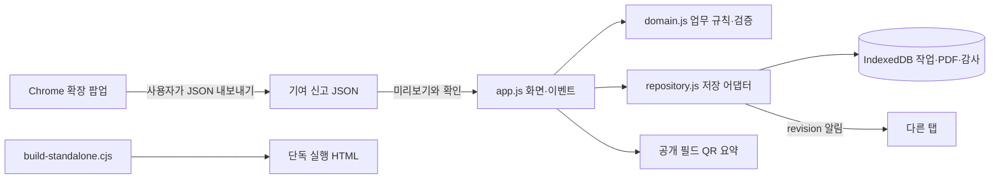
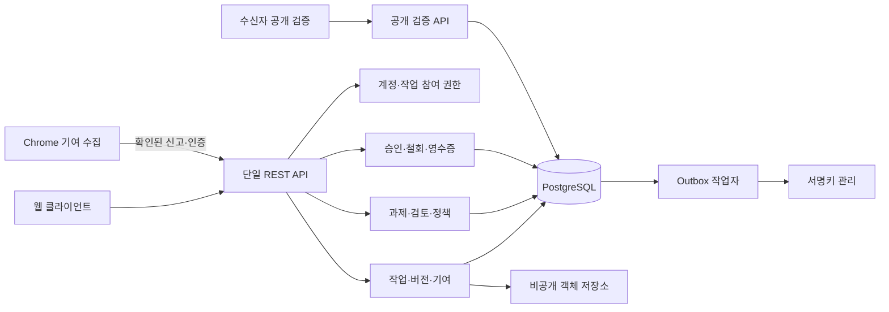
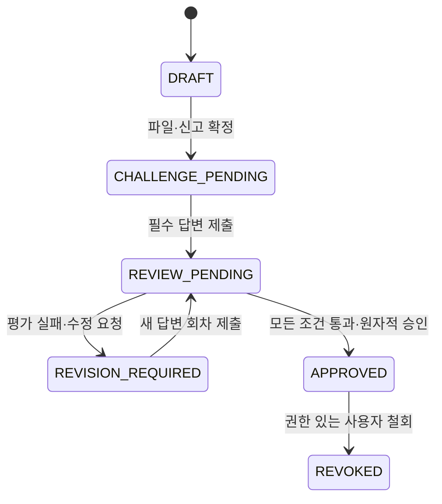

# HumanProof 아키텍처 검토와 구현 경계

2026-10-07. 검토 대상은 이 저장소의 발표 프로토타입과 제공된 7쪽 PDF 설계서다. 첨부 SWE3.png는 인간과 확인 표시를 연결한 브랜드 이미지이며 기능 명세는 아니다. 문서 속 개발 지시와 일정은 참고 자료로 읽었고, 현재 사용자 요청에 필요한 개선을 선택했다.

## 현재 구조에 대한 평가

파일 버전과 승인을 묶고, 인간 평가와 파일 일치를 분리한 도메인 방향은 적절하다. 이해 확인이 실제 이해나 사실 정확성을 보증하지 않는다는 설명도 유지해야 한다. 다만 변경 전 구현은 화면·업무 규칙·저장·감사·QR 처리가 `app.js` 하나에 모인 발표 데모였다. 설계서의 REST API, 사용자 계정, PostgreSQL, 객체 저장소, 서버 서명은 구현되지 않았다. 크롬 확장 소스도 존재하지 않았다.

따라서 평가 기준은 두 가지다. 발표 핵심 경로는 이미 작동하지만, 운영 서비스의 보안·권한·내구성을 갖춘 아키텍처라고 볼 수는 없다. 이번 변경은 데모의 실제 결함을 수정하고 운영 MVP의 책임·트랜잭션 경계를 정리한다.

| 점검 항목 | 발견한 문제 | 이번 처리 |
| --- | --- | --- |
| 파일 저장 | 20 MB 파일을 Base64로 localStorage에 넣어 용량 한도를 넘길 수 있음 | IndexedDB로 이동, 저장 완료 이후 성공 표시 |
| 저장 실패 | 메모리 상태만 승인 완료로 남을 수 있음 | 변경·승인·감사 이벤트를 한 레코드로 원자적 저장, 실패 시 롤백, 실패 입력 백업 |
| 동시 탭 | 이전 상태로 다른 탭의 변경을 덮어쓸 수 있음 | revision을 IndexedDB readwrite 트랜잭션에서 비교, 충돌 시 최신 기록 확인 후 재시도 |
| 수정 요청 | 이전 점수·메모가 현재 답변에 섞일 수 있음 | 검토 회차 보존, 평가·체크리스트·메모 초기화, 모두 재제출한 뒤 수정 요청 해제 |
| 승인 범위 | 영수증에 답변·기여 근거 전체의 고정 범위가 불명확함 | 정책·답변·평가·체크리스트·메모·기여 근거의 reviewDigest 추가 |
| 상태 | 과거 버전도 최신 승인처럼 보일 수 있음 | 후속 버전 존재와 철회를 별도로 표시 |
| QR 입력 | 파일명·철회 시각 등 일부 필드 검증이 빠짐 | 길이·자료형·날짜·해시 검증, 공개 필드만 복사, 과도한 URL 거부 |
| 저장값 로딩 | 형식·파일·영수증·체인을 충분히 확인하지 않음 | 구조와 해시 검증, 손상 시 자동 삭제하지 않고 백업·명시적 복구 화면 제공 |
| 크롬 확장 | 기존 구현 없음 | 사용자 확인을 거치는 MV3 로컬 기여 기록 도구 추가 |

## 지금 구현된 구성

- `domain.js`: 승인 판정, 상태, 불변식, 공개 필드, 기여 입력 검증, PDF·영수증·감사 체인 검증. DOM과 저장소에 의존하지 않는다.
- `repository.js`: IndexedDB 열기·조회·revision 조건부 저장. 저장값은 작업 aggregate 전체다. 트랜잭션 abort는 승인과 감사 이벤트를 함께 취소한다.
- `app.js`: 화면·사용자 입력·시연 역할·워크플로 조정. 모든 쓰기는 직렬화된 transaction을 거친다. DOM 성공 표시와 알림은 저장 성공 후 실행한다.
- `extension/`: 클릭한 현재 탭만 접근한다. 설명·제목·URL과 선택적으로 선택 텍스트를 확인 후 로컬 저장한다. 네트워크 전송, 자동 승인, 상시 페이지 수집을 제공하지 않는다.
- `scripts/build-standalone.cjs`: dist의 실제 소스로 단독 HTML을 재생성한다. 두 배포 형태가 다른 로직을 갖지 않게 한다.

데모는 한 작업을 다룬다. 새 작업·초기화는 기존 작업을 대체한다고 화면에서 명시한다. IndexedDB는 큰 파일의 localStorage 한도 문제를 해결하지만 영구 보관소는 아니다. 브라우저 데이터 삭제·기기 분실·저장소 quota가 여전히 가능하다. 기존 localStorage 사본은 성공적으로 이전한 뒤에도 복구용으로 남긴다. 정상 변경은 IndexedDB에만 저장하므로 과거 사본의 내용은 이후 최신 상태가 아니다.

현재 PDF 바이트는 Base64로 작업 레코드에 들어간다. 많은 버전과 빠른 입력을 처리하는 운영 서비스에서는 메타데이터와 파일을 분리해야 한다. 이번에 실제 서버가 생긴 것처럼 설명하지 않는다.

## 운영 MVP의 권장 구성: 모듈형 단일 서버

팀 규모와 6~8주 제안 일정에는 서비스 분산보다 단일 API 안의 명확한 모듈 경계가 적절하다. 인증·DB 트랜잭션과 배포 수를 줄이면서 후속 확장에 필요한 책임을 분리한다. 프론트는 API 응답 상태를 표시하며 승인 여부를 결정하는 권한은 서버에 둔다.

| 모듈 | 책임 | 다른 모듈과의 계약 |
| --- | --- | --- |
| Identity / Membership | 로그인·작업별 멤버십·검토자 배정 | userId는 세션에서만 취득, 요청 body의 역할을 신뢰하지 않음 |
| Work / Version | 업로드·해시·AI 신고·기여·검토 대상 스냅샷 | 파일과 신고 변경은 새 버전, 최종 제출한 범위는 고정 |
| Review | 위험 근거·정책·문항 스냅샷·답변 회차·평가·체크리스트 | 평가가 어떤 답변 revision에 대한 것인지 명시 |
| Approval | 승인 가능 조건·독립 검토자·중복 요청·철회 | 대상 version과 review snapshot을 다시 확인하고 트랜잭션으로 기록 |
| Receipt / Public Verification | 정규 payload·서명·공개 최소 정보 | 서명 검증, 현재 효력, 파일 일치를 독립적으로 반환 |
| Audit / Outbox | append-only 이벤트·순번·외부 작업 재시도 | 업무 트랜잭션 안에 이벤트와 outbox 저장 |

## 먼저 고정할 불변식과 상태

1. 승인된 파일·AI 신고·답변·평가·체크리스트·기여 범위는 바꾸지 않는다. 후속 변경은 새 버전으로 등록한다.
2. 작성자는 자신의 버전을 승인할 수 없다. 배정된 검토자만 평가하며 작업별 접근 권한을 모든 API에서 검사한다.
3. 평가에는 답변 revision, rubric version, reviewer, 근거를 저장한다. 재제출은 이전 평가를 현재 판정에서 제외한다.
4. 체크리스트에는 version뿐 아니라 review snapshot hash를 저장한다. 근거를 추가하면 기존 체크는 무효화한다.
5. 승인·영수증 발급 요청·감사 이벤트는 같은 DB 트랜잭션에 기록한다. 재시도는 기존 결과를 돌려준다.
6. 철회는 단방향 상태다. 재승인을 원하면 새 버전과 새 검토를 만든다. 공개 토큰 폐기와 승인 철회는 서로 다른 이벤트다.
7. 정책은 작업에 사용한 스냅샷으로 고정한다. 정책 변경으로 과거 판정을 조용히 다시 계산하지 않는다.

`SUPERSEDED`는 “같은 작업에 후속 버전이 존재한다”는 관계로 계산한다. 승인 v1은 v1의 과거 기록으로 남고, v2가 미승인이라는 사실을 별도로 반환한다. 철회와 후속 버전 존재가 동시에 가능하므로 하나의 status enum에 모든 의미를 밀어 넣지 않는다.

PDF의 “70% 이상”은 세 과제 0~2점에 대해 최소 정수 점수 5/6이다. 현재 데모는 위험도와 무관하게 3종 과제를 고정한다. 위험별 동적 배정, Human Edit, Micro Defense, 수동 이의 재평가는 운영 MVP/확장 백로그이며 이번 구현에서 지원한다고 표시하지 않는다.

## 승인 트랜잭션과 API 예외

승인 요청은 `Idempotency-Key`와 `expectedVersionRevision`을 요구한다. 작업/버전 row lock 획득 → 세션 사용자와 멤버십 확인 → 현재 version/review digest 확인 → gate·체크리스트 검증 → 승인 insert → receipt payload/outbox·audit insert → commit 순서다. 입력 검사는 UI와 서버 모두 수행하되 서버가 최종 판단한다.

- idempotency 키 범위는 `(actor_id, endpoint, key)`이고 요청 body hash를 함께 저장한다. 같은 키·같은 요청은 기존 결과를 돌려주며 같은 키·다른 요청은 409로 거부한다.
- DB 제약은 `UNIQUE(work_id, version_number)`, `UNIQUE(version_id, reviewer_id)` 및 단일 검토자 MVP의 `UNIQUE(version_id)`를 둔다. 설계서의 `(version_id, reviewer_id, decision)`만으로는 결정값을 바꾸어 중복 승인이 가능하므로 충분하지 않다.
- `responses`는 `challenge_id, response_revision`으로 구분한다. `evaluations`는 새 회차별 기록이며 이전 평가를 덮어쓰지 않는다. 이의 재평가는 append-only 판정 이력으로 남긴다.
- audit에는 작업별 단조 증가 `sequence`, `prev_hash`, canonical event hash를 저장하고 `UNIQUE(work_id, sequence)`를 둔다. 업무 변경과 이벤트 저장의 트랜잭션 경계를 일치시킨다.
- outbox 서명 상태는 `PENDING / READY / FAILED`로 공개한다. 승인 의사결정이 기록됐더라도 서명 영수증이 준비되지 않았으면 “서명 검증 완료”라고 표시하지 않는다. 재시도는 동일 receipt ID와 동일 payload를 사용한다.

| 상황 | 응답/처리 |
| --- | --- |
| 입력 타입·길이·파일 위장 오류 | 400, 필드별 오류 코드·메시지 |
| 인증 만료 | 401, 입력 초안을 보존하고 재로그인 유도 |
| 작업 접근 권한 없음 | 외부에는 404, 내부에는 권한 거부 감사 이벤트 |
| 배정되지 않은 평가·자기 승인 | 403 |
| 오래된 version/review revision | 409, 최신 revision 반환, 자동 승인 재시도 금지 |
| 같은 idempotency 키에 다른 요청 | 409 |
| gate 미통과·체크리스트 누락 | 422, 차단 사유 배열 |
| 용량 초과 | 413, 업로드 전에 가능한 한 안내 |
| 공개 조회·파일 비교 남용 | 429, Retry-After |
| 저장소·서명 작업 실패 | 503 또는 receipt PENDING, 중복 요청 없이 재시도 가능 |

## 파일·서명·개인정보 설계에서 빠뜨리지 않을 부분

업로드를 `STAGED → READY → EXPIRED/FAILED`로 관리한다. 스트림 전체 바이트를 서버에서 해시하고 크기 제한을 실제 바이트에 적용한다. DB 트랜잭션이 실패한 임시 객체는 수명 정책과 청소 작업으로 제거한다. 확장자/MIME/헤더 검사는 파일 파서나 악성 파일 검사와 다르므로, 운영 서비스는 PDF 구조 검사·악성 파일 격리 후 READY로 전환한다. 사용자 파일명은 저장 경로로 사용하지 않는다. 다운로드에는 접근 검사와 짧은 수명의 URL을 사용한다.

영수증 payload는 schema version, work/version ID, 파일 SHA-256, AI 신고 hash, review digest, policy version, 검토자 ID, 서버 승인 시각을 포함한다. 시스템 간 정규화 규격을 고정하고 동일 바이트를 서명한다. Ed25519 비밀키는 브라우저와 DB 평문에 저장하지 않는다. key_id·공개키·회전 이력과 유출 시 처리 정책을 둔다. 현재 JS canonical 함수는 시연용 제한된 데이터의 해시 정렬이며 운영용 표준 정규화 구현을 대체하지 않는다.

공개 URL에는 답변·메모·이메일·파일명 같은 민감정보를 무조건 싣지 않는다. 최소 필드를 명시하고 랜덤 토큰 원문 대신 hash를 DB에 저장한다. 공개 API는 응답에 서명 상태, 조회 시각, 현재 철회/후속 버전 관계, 파일 비교 결과를 구분한다. 현재 데모 QR은 **서명 없는 발급 당시 요약**이다. 다른 기기의 철회 상태를 실시간으로 알 수 없다. 공개 페이지의 캐시 때문에 철회 반영이 지연되지 않도록 조회 정책을 별도로 둔다.

해시 체인은 중간 이벤트 변경을 탐지하지만 신뢰할 수 있는 외부 anchor 없이는 끝부분 삭제나 전체 체인 재작성까지 입증하지 못한다. 독립 감사 저장·외부 타임스탬프는 후속 단계다. 보존 기간·작업 삭제·파일 삭제·감사 보존과 개인정보 삭제의 충돌도 정책으로 정해야 한다.

## Chrome 확장 검토와 연결 계약

이번에 추가한 확장은 `activeTab`, `scripting`, `storage`만 사용한다. 사용자 호출에 따른 임시 탭 접근은 [Chrome activeTab 문서](https://developer.chrome.com/docs/extensions/develop/concepts/activeTab)에 근거한다. 로컬 기록은 [Storage API](https://developer.chrome.com/docs/extensions/reference/api/storage)에 저장하고 TRUSTED_CONTEXTS로 접근을 제한한다. 외부 코드 실행·inline script 없이 [MV3 CSP](https://developer.chrome.com/docs/extensions/reference/manifest/content-security-policy)를 적용한다.

팝업만 쓰므로 중단·재시작되는 background service worker에 작업 상태를 맡길 필요가 없다. 여러 창의 팝업 쓰기는 Web Locks로 직렬화하고 저장 완료 뒤에만 성공을 알린다. 닫기 전 완료된 기록은 chrome.storage.local에서 다시 읽는다. 페이지 내용은 textContent로 출력한다. URL의 query와 fragment를 제거하지만 경로·제목·선택 텍스트에 개인정보가 남을 수 있어 사용자가 미리 보고 수정하도록 한다. 전체 웹 접근 권한·쿠키 읽기·파일 읽기 권한을 요구하지 않는다.

확장 JSON은 승인 요청이 아니다. 웹에서 파일·개수·필드·URL 검증 → 미리보기 → 사용자 확인 → version 연결 → 현재 평가 무효화 순서로 처리한다. ID 중복은 다시 추가하지 않는다. 승인 후 가져오기는 차단한다. 서버 연동 시에도 확장 데이터를 클라이언트 신고로 보고 사용자 권한과 version revision을 서버에서 검사해야 한다.

향후 API 전송을 붙이면 사이트별 optional host permission, 로그인 만료·로그아웃 시 자격정보 정리, 최소 수명 인증, idempotency 키, offline outbox 재전송·삭제, 401/403/409/429 처리부터 설계한다. 모든 AI 사이트의 DOM을 자동 파싱하여 AI 활용 비율을 사실로 판정하는 기능은 신뢰할 수 있는 증명이 되지 않는다.

## 검증과 다음 구현 순서

자동 검증은 순수 도메인/확장 데이터 테스트와 실제 Chrome에서의 프로토타입 흐름으로 나눈다. 브라우저 테스트는 격리된 프로필과 테스트 서버를 사용한다. 확장 팝업의 Chrome API 오류는 별도 모의 API 테스트로 확인하며 실제 설치·툴바 호출·권한 활성화는 설치 후 수동 검증 항목이다.

다음 서버 구현의 우선순위는 (1) 세션·작업 멤버십과 비공개 파일 접근, (2) 버전/검토 회차 DB 제약과 원자적 승인·idempotency, (3) 영수증 서명과 현재 상태 공개 조회, (4) 객체 저장 실패 복구·보존 정책·관측성이다. 복수 승인자와 AI 채점 보조는 이 기반이 통과한 뒤 추가한다.
